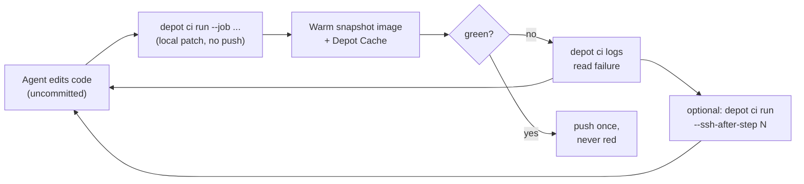

# Depot CI Demo: Depot CI as the Agentic "Verification Substrate"

## What the audience actually asked (and how we answer it)

The ask decomposes into four concrete questions. The demo is structured so each beat answers one:

- **"Dynamic workflows"** -> the agent authors and runs a CI workflow on the fly, in a language it already knows (GitHub Actions YAML), scoped to exactly the change it made.
- **"Intelligence around which validation loops to run"** -> the agent inspects the workflow, picks only the relevant job(s) with `--job`, and reruns only what failed instead of re-running the world.
- **"How your caching layer works to enable this"** -> a pre-baked Depot CI snapshot image (`.depot/workflows/snapshot-e2e.yml`) + Depot Cache means every loop starts warm in seconds, not from a cold `apt-get`/`pnpm install`/`go mod download`.
- **"How this is different from alternatives"** -> Depot CI runs your *uncommitted local diff* via API/CLI in seconds. Every other CI (GHA, CircleCI, Buildkite) is push-triggered and a black box. This is "push-wait-guess" vs. a local closed loop.

The one-line story (already drafted in [.demo/DEMO.md](.demo/DEMO.md)): *an agent validates its own uncommitted code against real CI in seconds, reads the failure programmatically, fixes it, reruns only the failed job, and pushes once green, having never pushed a broken commit.*

## The loop we are demonstrating



Everything below already exists in the repo or is a small, low-risk addition. We are not building a new product; we are wiring the existing `false-flag-demo` codebase into a tight, reproducible agent loop.

## Assets already in the repo (leverage these)

- [.depot/workflows/snapshot-e2e.yml](.depot/workflows/snapshot-e2e.yml) - builds the custom CI base image (`3njzjqc81m.registry.depot.dev/falseflag-ci-base:...`) baking Go 1.26, Node 22, pnpm, Spectral, Playwright + Chromium, and the Postgres image via `depot/snapshot-action`. **This is the visual proof of "your caching layer."**
- [.depot/workflows/ci.yml](.depot/workflows/ci.yml) - the migrated 16-job baseline (lint, test-go, test-go-race, test-js, build-js, conformance, contract-test, build-images, image-scan, smoke, dashboard-e2e). Jobs run on `depot-ubuntu-latest` and the custom image; `dashboard-e2e` already shards 6x and `lint`/`dashboard-e2e` already consume the snapshot image.
- [.depot/workflows/lint.yml](.depot/workflows/lint.yml) - shows `runs-on: { size: 4x16, image: <snapshot> }` + parallel steps; good to point at for "right-sized, warm sandbox."
- [depot.json](depot.json) - project `mr31tm4wc4`; CLI is installed (`depot v2.101.65`).
- Remote is `boscloud-engine/false-flag-demo` (origin), Depot org `3njzjqc81m`, working branch `main`. (`Zagrit-HQ/false-flag-demo` is the `upstream` remote.)

## Pre-staged live code change (deterministic failure)

To keep a *live* demo reliable, pre-rehearse one specific change that produces a clean, self-inflicted failure the agent can diagnose and fix:

- The flag evaluation engine has a Go implementation in [internal/eval/predicates.go](internal/eval/predicates.go) and a byte-identical TypeScript twin (cel-lite) under `js/packages/sdk-js`. A cross-runtime "conformance" corpus is asserted by **both** runtimes (`internal/eval/cross_runtime_test.go`, `internal/sdkgo/conformance_test.go`, and the JS `conformance` test). `make conformance` runs both halves.
- **The demo task:** ask the agent to add a new string operator (e.g. `starts_with`) to the flag targeting language, plus a corpus fixture that uses it.
- **The deterministic failure:** if the agent implements the Go side first (natural order), the `conformance` / cross-runtime job fails because the TS twin doesn't know the operator yet -> a real, repo-grounded mismatch, not a contrived `exit 1`. The agent reads the log, adds the TS implementation, reruns just that job, green.
- This is honest (it's a genuine consequence of the dual-runtime design) and 100% reproducible on stage.

## Prep checklist (do before the call)

1. **Confirm Depot CI access**: `depot login` (or `DEPOT_TOKEN`), and confirm the Depot Code Access GitHub App is installed on `boscloud-engine/false-flag-demo` (`depot ci migrate preflight --org 3njzjqc81m`).
2. **Ensure the snapshot image is fresh**: trigger [.depot/workflows/snapshot-e2e.yml](.depot/workflows/snapshot-e2e.yml) once so the warm image exists in the registry (it is `workflow_dispatch`). This is also a great thing to *show* as "the agent baked its dependencies once."
3. **Install the agent loop harness** (VS Code with the Claude Code extension is the live IDE - the harness is tiny):
   - `.claude/commands/fix-ci.md` (the run/status/logs/ssh loop) + `.claude/settings.json` with `{"permissions":{"allow":["Bash(depot:*)"]}}` so the agent can run `depot` without prompting.
   - Install Depot skills so the agent has the full CLI reference: `npx skills add depot/skills`.
4. **Author the "dynamic" agent workflow** `.depot/workflows/agent-validate.yml`: a small workflow that uses the snapshot image and runs only `conformance` + `test-go` (the checks relevant to an eval-engine change). Present this on stage as "the agent writes a validation loop scoped to its own change." Keep it pre-written but uncommitted so it looks freshly generated; optionally let the agent generate it live if rehearsal is solid.
5. **Rehearse the exact change** (the `starts_with` operator) end to end 2-3 times; capture a screen recording as the fallback.
6. **Warm the cache**: run the conformance/test-go jobs once before the call so Depot Cache and the snapshot image are hot and the on-stage loop is seconds.
7. **Reset to a clean tree** on `main` right before starting.

## Run-of-show (5-10 minutes, live)

### 0. Cold open - the problem (~45s, talk only)
"Every CI today is push-wait-guess. You commit a hypothesis, push, wait 15-20 minutes, squint at logs. That's death for an agent doing 30 iterations an hour." Show the 16-job [.depot/workflows/ci.yml](.depot/workflows/ci.yml) scrolling - "this is a real pipeline: Go, TS, Postgres + SQLite matrices, Playwright sharded 6x, image scans. Normally a black box."

### 1. The substrate / caching layer (~1 min)
Open [.depot/workflows/snapshot-e2e.yml](.depot/workflows/snapshot-e2e.yml). "Step one: the agent baked every heavy dependency - Go, Node, pnpm, Playwright + Chromium, Postgres - into one Depot CI snapshot image, once." Then show [.depot/workflows/lint.yml](.depot/workflows/lint.yml) `runs-on: { image: <snapshot> }`. "Every validation loop now boots from this warm image. That's the caching layer that makes the inner loop fast enough to matter."

### 2. Agent writes code (~1 min)
In VS Code (Claude Code extension), prompt the agent: *"Add a `starts_with` string operator to the flag targeting engine and a corpus fixture that uses it."* It edits [internal/eval/predicates.go](internal/eval/predicates.go) (+ config wiring + a fixture). Leave it **uncommitted**. "No commit. No push. This is just my working tree."

### 3. Local-first validation, scoped (~2 min) - the centerpiece
Agent runs (via the `/fix-ci`-style loop):
```bash
depot ci run --org 3njzjqc81m --workflow .depot/workflows/ci.yml --job conformance
```
"It uploaded my *uncommitted diff* as a patch and ran it on real CI. No other CI on the market does this." It fails (Go has the operator, TS twin doesn't). Agent reads it programmatically:
```bash
depot ci status <run-id> --org 3njzjqc81m
depot ci diagnose --org 3njzjqc81m --run <run-id>
depot ci logs <attempt-id> --org 3njzjqc81m
```
Agent fixes the TS twin (cel-lite) locally, then reruns only the failed work:
```bash
depot ci run --org 3njzjqc81m --workflow .depot/workflows/ci.yml --job conformance
```
Green. "It reran *only* the job that mattered - intelligence about which validation loop to run - and it took seconds because the sandbox was warm."

### 4. (Optional, high-impact) Open the hood (~1 min)
If time and nerves allow, show the differentiator no other CI has:
```bash
depot ci run --org 3njzjqc81m --workflow .depot/workflows/ci.yml --job conformance --ssh-after-step 2
depot ci ssh <run-id> --org 3njzjqc81m
```
`pwd`, `ls` - "the agent can stand on the actual machine and check reality instead of guessing from logs."

### 5. Dynamic workflow on the fly (~1-1.5 min) - answers "dynamic workflows"
Reveal `.depot/workflows/agent-validate.yml` (the scoped workflow). "The agent wrote its own validation loop, in GitHub Actions YAML it already understands, using the cached image, running only the checks its change touches."
```bash
depot ci run --org 3njzjqc81m --workflow .depot/workflows/agent-validate.yml
```
Green in seconds.

### 6. Push once, never red (~30s)
```bash
git add -A && git commit -m "feat(eval): add starts_with operator" && git push
```
Show the same workflow now running as a GitHub check on the PR. "It pushed exactly once, already green. It never pushed a broken commit."

### 7. The "why us" close (~45s)
Land the verification-substrate framing:
- API/CLI-driven, runs *uncommitted local diffs* -> the only CI that fits inside an agent's inner loop.
- Pre-warmed sandboxes + snapshot images + Depot Cache -> seconds, not minutes; the agent isn't re-running the world on every typo fix.
- Same workflow runs locally and in CI -> zero drift between "what the agent checked" and "what gates the PR."
- Everyone else is push-triggered and opaque. As agents write more code, the bottleneck moves from writing to *verifying* - and Depot is the verification substrate that makes agentic engineering safe and fast.

## Risk management / fallbacks
- Keep a **screen recording** of a clean run-of-show as the hard fallback.
- Have `depot ci run list --org 3njzjqc81m` / dashboard open in a tab to show prior green runs if a live run is slow.
- Pre-warm caches right before the call (step 6 of prep).
- If networking/SSH is flaky, skip beat 4 (it's optional).
- Keep the agent task small and rehearsed; do not improvise a new feature live.

## Deliverables to produce when we execute (out of plan-mode)
- `.claude/commands/fix-ci.md` + `.claude/settings.json` permissions.
- `.depot/workflows/agent-validate.yml` (scoped dynamic workflow).
- A rehearsed diff for the `starts_with` operator (Go + TS + fixture), staged but reverted before the live run.
- A short `.demo/DEMO.md` expansion documenting the run-of-show and exact commands.
